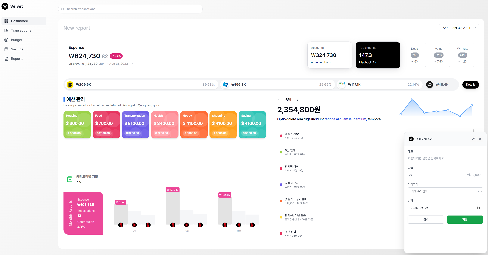

# Velvet

<div align="center">
  
[](#)
[](#)
[](#)
[](#)

</div>

> Personal Finance Management Web Application

<div align="center">
  
</div>

## ✨ Features

- 📊 **Dashboard**

  - Comprehensive Income/Expense Overview
  - Real-time Asset Tracking
  - Category-based Spending Analysis

- 💰 **Budget Management**

  - Category Budget Setting
  - Budget Achievement Visualization
  - Fixed Expense Management

- 📝 **Transaction History**

  - Multi-transaction Input Support
  - Calendar View
  - Smart Search

- 🎯 **Savings Goals**
  - Goal Setting
  - Progress Tracking
  - Savings Streak System

## 🚀 Development Status

### In Progress

- [ ] Dashboard Page

  - [ ] Expense Status
  - [ ] Expense Charts
  - [ ] Average Spending

- [ ] Transaction History Page
  - [ ] Transaction Input Template
  - [ ] Multi-transaction Support
  - [ ] Transaction Search
  - [ ] Calendar View

### Planned

- [ ] Budget Page

  - [ ] Category Budget Settings
  - [ ] Budget Achievement Visualization

- [ ] Savings Page

  - [ ] Savings Goal Setting
  - [ ] Savings Status Visualization

- [ ] Profile Management
  - [ ] Account/Card Management

### Additional Features

- [ ] Data Import/Export
- [ ] Excel Export
- [ ] Savings Streak
- [ ] Bookmarks

## 🛠 Tech Stack

- **Frontend**: React, TypeScript, Tailwind CSS
- **State Management**: TBD
- **Charts**: TBD
- **Styling**: Tailwind CSS
- **Development Tools**: Cursor, Vite, ESLint, Prettier

## 📦 Installation & Setup

```bash
# Clone repository
git clone https://github.com/jihunhong/velvet.git

# Move to directory
cd velvet

# Install dependencies
npm install

# Run development server
npm run dev
```

## 👨‍💻 Developer

- Development Period: 2024.03.31 ~
- Developer: [@jihunhong](https://github.com/jihunhong)

---

<div align="center">
  <sub>Built with ❤️ by <a href="https://github.com/jihunhong">@jihunhong</a></sub>
</div>
